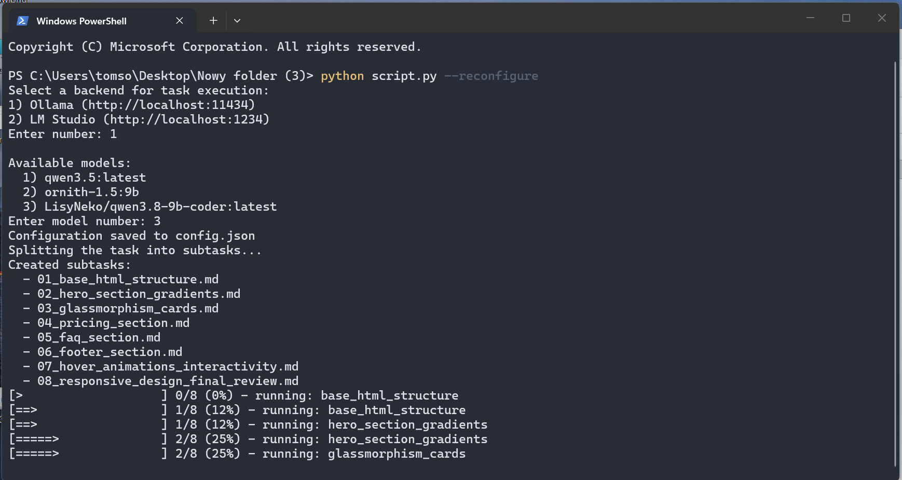

# Task Orchestrator via Local LLM (Ollama / LM Studio)

Splits a task into subtasks and executes them step-by-step via a local LLM through Ollama or LM Studio.

## Requirements

- Python 3.14+
- No third-party packages — `script.py` uses only the Python standard library (`urllib`)
- A running Ollama (`http://localhost:11434`) or LM Studio (`http://localhost:1234`) instance with at least one model pulled/loaded

## Installation

No installation required — just run `start.bat` (Windows), it creates the
`venv/` virtual environment automatically on first launch. You can also run
directly with your system Python:

```bat
python script.py
```

## Usage

1. Write your overall task description into `task.md` (plain Markdown, any language).
2. Run the script:

```bat
python script.py
```

On the first run you will be asked to choose a backend (Ollama / LM Studio) and a model. The choice is saved to `config.json`.

CLI flags:

- `--reconfigure` — ask for backend/model again and overwrite `config.json`
  ```bat
  python script.py --reconfigure
  ```
- `--resume` — continue from the last unfinished step (based on `progress.json`), without re-planning
  ```bat
  python script.py --resume
  ```
- `--dry-run` — only generate the subtask plan into `tasks/`, do not execute them
  ```bat
  python script.py --dry-run
  ```
- `--lang {en,ru}` — language of the generated plan/subtasks (default: `en`); console messages stay in English
  ```bat
  python script.py --dry-run --lang ru
  ```

On Windows you can also use `start.bat` (it picks `venv/` Python if present and forwards all arguments):

```bat
start.bat --dry-run
```

## Project Structure

```
project/
├── script.py        # main orchestrator script
├── task.md          # task description (written by user)
├── tasks/           # created by script — one .md file per subtask (01_slug.md, ...)
├── output/          # created by script — model answers per subtask
├── progress.json    # created by script — per-step status (done / pending / failed)
├── config.json      # created on first run — saved backend/base_url/model choice
├── start.bat        # Windows launcher (creates venv/ if missing, forwards all args)
└── README.md        # this file
```

`progress.json` example:

```json
{
  "steps": [
    {"id": 1, "slug": "hero_section", "status": "done", "duration_sec": 45.2},
    {"id": 2, "slug": "styles", "status": "pending"}
  ]
}
```

## How It Works

1. **Task splitting** — `task.md` is sent to the selected model with a planner prompt that requests a strict JSON plan (`{"steps": [...]}`). Each step becomes `tasks/NN_slug.md`. Up to 2 retries are attempted on invalid JSON; on failure the raw answer is saved to `tasks/00_raw_plan_failed.md`.
2. **Per-step execution** — each subtask file is sent to the model together with a short summary of previous steps (first meaningful line of each prior answer, not the full history). The full answer is saved to `output/NN_slug.md`.
3. **Progress tracking** — after each step `progress.json` is updated and a progress bar (`3/8 (37%)`) is printed. Failed steps (connection error, timeout) are marked `failed` without stopping the whole run; a final summary lists them.

## Notes / Limitations

- Small local models may struggle with complex planning or strict JSON output; if the plan is bad, edit `tasks/*.md` manually and re-run with `--resume`.
- Generation timeout is 300 seconds per request since local inference can be slow.
- Only one model is used for the whole run; multi-model comparison is out of scope.
- Recommend testing with `--dry-run` first to inspect the generated plan before the (slower) execution phase.

## Step-by-Step Usage Guide

1. **Set up (first run only)** — just launch `start.bat`; it creates the `venv/` virtual environment automatically. No packages need downloading: the script uses only the standard library.
   ```bat
   start.bat --help
   ```

2. **Start the backend** — launch Ollama (`ollama serve`, models via `ollama pull <name>`) or LM Studio (start the server on `http://localhost:1234` and load a model). The script cannot work without a running server.

3. **Describe your task** — open `task.md` and write what needs to be done (any language, plain Markdown). Example:
   ```markdown
   # Build a landing page
   Create a single-page site with a hero section, features grid,
   contact form, responsive styles, and a final self-review pass.
   ```

4. **Preview the plan (recommended)** — generate subtasks without executing them:
   ```bat
   start.bat --dry-run --lang en
   ```
   Use `--lang ru` if you want the plan and subtasks in Russian. Inspect the files in `tasks/` (`01_...md`, `02_...md`, …). If a step looks wrong, edit the `.md` file directly.

5. **Run the full pipeline**:
   ```bat
   start.bat
   ```
   On the first run you pick a backend (1 = Ollama, 2 = LM Studio) and a model; the choice is saved to `config.json`. Each step's answer lands in `output/NN_slug.md`, progress is tracked in `progress.json`, and a progress bar shows `done/total (%)`.

6. **If something fails** — failed steps are marked `failed` in `progress.json` and the run continues. Fix the cause (e.g. start the server, pick a stronger model), then resume without re-planning:
   ```bat
   start.bat --resume
   ```

7. **To switch backend/model** — re-run the setup:
   ```bat
   start.bat --reconfigure
   ```

8. **Collect the results** — finished outputs are in `output/` (one file per subtask, same names as in `tasks/`). The final console summary tells you how many steps succeeded and lists any failed ones.
